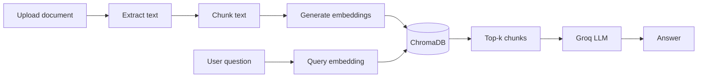

# RAG Chatbot

A full-stack **Retrieval-Augmented Generation (RAG)** chatbot. Upload PDF, DOCX, or TXT documents, index them in a local vector database, and ask questions whose answers are grounded in your uploaded content.

## Features

- **Document upload** — Drag-and-drop or browse for PDF, DOCX, and TXT files
- **Semantic search** — Chunks are embedded and stored in ChromaDB for similarity retrieval
- **Grounded answers** — Groq (Llama 3.3 70B) answers only from retrieved context
- **Chat UI** — React frontend with upload sidebar and conversational interface

## How it works



1. **Ingest** — Text is extracted from the file, split into overlapping chunks (~400 characters), and embedded with `all-MiniLM-L6-v2`.
2. **Store** — Chunks and embeddings are saved in a persistent ChromaDB collection (`chroma_db/`).
3. **Query** — The user’s question is embedded; the top 5 similar chunks are retrieved.
4. **Generate** — Retrieved text is passed as context to the LLM, which must answer from that context only.

## Tech stack

| Layer        | Technology                                      |
| ------------ | ----------------------------------------------- |
| Frontend     | React 19, Vite                                  |
| Backend      | FastAPI, Uvicorn                                |
| Embeddings   | [sentence-transformers](https://www.sbert.net/) (`all-MiniLM-L6-v2`) |
| Vector store | [ChromaDB](https://www.trychroma.com/)          |
| LLM          | [Groq](https://groq.com/) — `llama-3.3-70b-versatile` via LangChain |

## Prerequisites

- **Python** 3.10+
- **Node.js** 18+
- A **[Groq API key](https://console.groq.com/)** (free tier available)

## Setup

### 1. Clone and create a virtual environment

```bash
cd rag_task
python -m venv venv

# Windows
venv\Scripts\activate

# macOS / Linux
source venv/bin/activate
```

### 2. Install Python dependencies

```bash
pip install -r requirements.txt
```

> The first run downloads the embedding model (`all-MiniLM-L6-v2`), which may take a minute.

### 3. Configure environment variables

Create a `.env` file in the project root:

```env
GROQ_API_KEY=your_groq_api_key_here
```

The backend loads this via `python-dotenv` when the LLM service starts.

### 4. Install frontend dependencies

```bash
cd frontend
npm install
npm install axios
cd ..
```

`axios` is required for API calls from `UploadBox` and `ChatBox`.

## Running the app

Start the **backend** and **frontend** in separate terminals.

### Backend (port 8000)

From the `backend` directory:

```bash
cd backend
uvicorn app.main:app --reload --host 127.0.0.1 --port 8000
```

- API docs: [http://127.0.0.1:8000/docs](http://127.0.0.1:8000/docs)
- Health check: [http://127.0.0.1:8000/](http://127.0.0.1:8000/)

### Frontend (port 5173)

```bash
cd frontend
npm run dev
```

Open the URL shown in the terminal (typically [http://localhost:5173](http://localhost:5173)).

The UI calls the API at `http://127.0.0.1:8000`. Keep both servers running while you use the app.

## API reference

| Method | Endpoint   | Description                          |
| ------ | ---------- | ------------------------------------ |
| `GET`  | `/`        | Health check                         |
| `POST` | `/upload/` | Upload and index a document          |
| `POST` | `/chat/`   | Ask a question about indexed content |

### Upload

```http
POST /upload/
Content-Type: multipart/form-data

file: <PDF | DOCX | TXT>
```

**Response**

```json
{
  "message": "File uploaded and processed successfully",
  "chunks": 42
}
```

### Chat

```http
POST /chat/
Content-Type: application/json

{ "question": "What does the document say about ...?" }
```

**Response**

```json
{
  "answer": "..."
}
```

## Project structure

```
rag_task/
├── backend/
│   ├── app/
│   │   ├── main.py              # FastAPI app & CORS
│   │   ├── routes/
│   │   │   ├── upload.py        # File upload endpoint
│   │   │   └── chat.py          # Chat endpoint
│   │   └── services/
│   │       ├── file_extractor.py
│   │       ├── embeddings.py
│   │       ├── storage.py       # ChromaDB
│   │       ├── llm.py           # Groq + prompt
│   │       └── rag.py           # Chunking & RAG pipeline
│   └── chroma_db/               # Vector DB (created at runtime)
├── frontend/
│   └── src/
│       ├── App.jsx
│       └── components/
│           ├── UploadBox.jsx
│           └── ChatBox.jsx
├── requirements.txt
├── .env                         # GROQ_API_KEY (not committed)
└── README.md
```

## Supported file types

| Extension | Library        |
| --------- | -------------- |
| `.pdf`    | pypdf          |
| `.docx`   | python-docx    |
| `.txt`    | UTF-8 decode   |

Other formats will return an error from the extractor.

## Notes

- **Vector data** is stored under `backend/chroma_db/` when the server is run from `backend/`. Re-uploading documents adds new chunks; there is no delete endpoint yet.
- **Context-only answers** — If the answer is not in the retrieved chunks, the model is instructed to say: *"The information is not available in the provided document."*
- **CORS** is open (`*`) for local development; tighten this before deploying to production.

## License

Add your license here if you plan to open-source or share this project.
